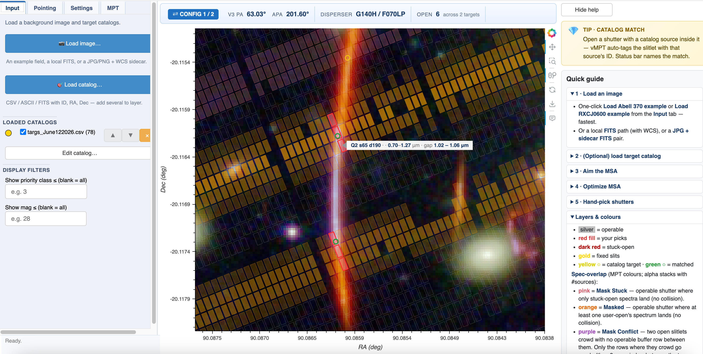

<h1>
  
  vMPT — visual MSA Planning Tool
</h1>

Interactive Bokeh app for planning JWST/NIRSpec MSA observations
**directly on an image of the target field**. vMPT combines:

- **Automated MSA pointing optimization** — derived from [hMPT](https://github.com/zihaowu-astro/hMPT)
  (Zihao Wu et al., CfA|Harvard), itself a Python re-implementation
  of ESA's eMPT (Bonaventura et al. 2023). Grid + differential-
  evolution search over (RA, Dec, V3 PA) in three modes: Democracy
  (count), Meritocracy (Σ weight), Hierarchy (strict priority
  tiers).
- **Shutter-collision protection** — mark high-priority targets
  whose spectra must not overlap any other source on the detector
  under the current Disperser / Filter. Slitlet-aware row buffer
  (`v1.2.1+`) reserves one row above and below each protected
  slitlet, including against stuck-open shutters.
- **Hand-picking + live conflict feedback** — click any shutter to
  open an N-shutter slitlet, watch the orange spec-overlap layer
  light up in real time, undo / redo at will.
- **APT / eMPT-ready export** — write an MPT_plan.json + .cat
  bundle that loads straight into APT, plus the three CSVs that
  feed the [eMPT pipeline](https://github.com/esdc-esac-esa-int/eMPT_v1).
- **Sharing** — save the whole session as a JSON file, send it to a
  collaborator, and they pick up exactly where you left off.




*The vMPT interface running against the RXCJ0600 example: target-field
image (centre) with the 4 MSA quadrants overlaid at the chosen V3 PA,
stuck-open shutters as dark-red outlines, user picks as red fills,
spec-overlap rows in orange. Left sidebar: image / aim / pick / MPT
tabs. Right panel: rotating tip card + quick-reference legend.*

---

## Installation

vMPT is a local-only tool: it runs on your machine, files stay on
your disk, computation uses your local Python.

### Option A — pip install (recommended, **v1.2.2+**)

vMPT is on PyPI as [`jwst-vmpt`](https://pypi.org/project/jwst-vmpt/):

```bash
pip install jwst-vmpt
vmpt                                                             # opens the app
```

The console script `vmpt` accepts the same flags as `run.sh`:

```bash
vmpt --port 5010                                                 # different port
vmpt --fits img.fits --catalog a.csv --catalog b.csv             # stack catalogs
vmpt --jpg img.jpg --wcs wcs.fits --catalog targets.csv          # JPG + WCS pair
vmpt examples download                                           # fetch example_a370 + example_r0600
```

The wheel itself is ~20 MB (just the MSA grid + dispersion table).
The two example datasets (~64 MB combined) are fetched on demand
via `vmpt examples download`, dropping `example_a370/` and
`example_r0600/` into the current directory.

### Option B — STScI's `stenv` from source (for JWST pipeline users)

If you already use the [STScI JWST/HST pipeline environment](https://stenv.readthedocs.io/),
most dependencies are already present:

```bash
git clone https://github.com/fengwusun/vMPT.git
cd vMPT
conda activate stenv
pip install bokeh jwst_gtvt
./run.sh                  # bokeh serve vmpt/ under the hood
```

The browser should open at `http://localhost:5006/app`.

### Option C — fresh conda env from source

```bash
git clone https://github.com/fengwusun/vMPT.git
cd vMPT
conda create -n vmpt python=3.11
conda activate vmpt
pip install -r requirements.txt
./run.sh
```

### Option D — plain pip + venv from source

```bash
git clone https://github.com/fengwusun/vMPT.git
cd vMPT
python -m venv .venv
source .venv/bin/activate
pip install -r requirements.txt
./run.sh
```

### Verify the install

```bash
pytest tests/    # 139 passed, 4 skipped; ~15 seconds
```

If everything's green, the tool is ready. If `pytest` complains about
a missing module, check that you're in the right environment.

---

## First-time use — two-minute tour

The repo ships with two example fields you can load with one click.

1. **Start the server**:
   ```bash
   ./run.sh
   ```
   Browser opens at `http://localhost:5006/app`. If it doesn't, open
   that URL yourself.

   Optional flags pre-load files and pick a port:
   ```bash
   ./run.sh --port 5010                         # default is 5006
   ./run.sh --fits path/to/image.fits
   ./run.sh --jpg path/to/image.jpg --wcs path/to/wcs.fits
   ./run.sh --catalog targets.csv               # repeat to stack
   ./run.sh --port 5010 --fits img.fits --catalog a.csv --catalog b.csv
   ```
   `--jpg` and `--wcs` must come as a pair; `--fits` is mutually
   exclusive with them.

2. **Load an example** from the **Input** tab (left sidebar):
   - **"Load Abell 370 example"** — a 42 MB three-band FITS at
     `example_a370/a370_f182m_f200w_f210m.fits` (JWST/NIRCam F182M +
     F200W + F210M). Includes a target catalog and an APT MPT plan
     from GTO-1208 you can load to see the full picking workflow.
   - **"Load RXCJ0600 example"** — a 17 MB JPG + WCS-sidecar pair
     (`example_r0600/*`). Demonstrates the JPG+sidecar workflow.
     Includes a ~28k-source target catalog.

   Both examples are committed in the repo (no extra download
   needed). A full-page spinner overlays the canvas during loads so
   you know the app is busy.

   Tabs in the left sidebar:
   - **Input** — image + catalog loading.
   - **Pointing** — RA/Dec/V3 PA, disperser/filter, visibility window,
     and the MSA pointing optimizer.
   - **Setting** — layers, slitlet size, snap-to-operable, overlay
     appearance, undo/clear.
   - **MPT** — import/export APT plans + session save/load.

3. **Aim the MSA** in the **Pointing** tab:
   - The pointing center auto-fills to the image center (unless a
     plan was loaded first — in that case the plan's RA/Dec is kept).
   - Drag the **V3 PA** slider or type into the **APA** box. The
     spinner appears during recomputation.
   - Pick a **disperser / filter** from the dropdown (e.g. PRISM /
     CLEAR or G395H / F290LP). The wavelength endpoints + NRS1/NRS2
     detector-gap on each open shutter come from a per-shutter table
     pre-computed via msaviz (see *Wavelength accuracy* below).
   - Optional: enter a date and click **"Compute allowed V3 PA"** —
     queries `jwst_gtvt` and reports the valid V3 PA window for that
     date.
   - Optional: **MSA pointing optimizer** at the bottom of the tab.
     See the next section.

4. **Pick shutters** in the **Setting** tab + on the image:
   - **Click on the image** → opens an **N-shutter slitlet** at the
     nearest operable shutter. Choose N in the **Slitlet** dropdown:
       - `N=1` → only the clicked shutter
       - `N=2` → click + one row lower (lower y on the detector)
       - `N=3` → centred 3-shutter slitlet (the standard for MOS)
       - `N=5` → centred 5-shutter slitlet
   - **Click an open shutter** → closes it AND its slitlet siblings.
   - **Double-click** → toggles a cyan highlight (a visual flag, not
     exported).
   - **Shift-click** → moves the pointing center to that location.
   - **Wheel** → zoom both axes equally.
   - **Drag** → pan.

   If a catalog is loaded, vMPT auto-tags the slitlet with the
   catalog source ID whose footprint falls inside any opened shutter.
   The status bar shows which source was matched.

5. **Save and export** in the **MPT** tab:
   - **Save session** → writes the bundle (see "Bundle output" below)
     to a single chosen directory. Share the directory with a
     collaborator to hand off the work.
   - **Load session** → restores any vMPT bundle (point at either
     `MPT_plan.json` or `vMPT_workspace.json` — both work; the
     sibling is auto-discovered).
   - **Export eMPT bundle** → same writer as Save session, but into
     a fresh timestamped subfolder of `exports/`.

---

## MSA pointing optimizer

Bottom of the **Pointing** tab. Searches for an (RA, Dec, V3 PA) that
maximises the number — or weighted flux — of catalog sources placed in
operable, well-centred MSA shutters.

The algorithm is re-implemented in vMPT style from
[**hMPT**](https://github.com/zihaowu-astro/hMPT) (Zihao Wu, Daniel Eisenstein,
Samuel McCarty; CfA/Harvard), itself derived from ESA's
eMPT. See `app/optimizer.py` for the module-level docstring with
attribution + algorithm notes.

### Method

Three modes, picked from the **Method** dropdown:

- **Democracy** — every source counts the same. Maximises the raw
  number of sources placed. Works on any catalog, no extra columns
  required. (This was the previous default behaviour.)
- **Meritocracy** — sum of `weight` of placed sources. A weight-3
  source equals 1.5 weight-2 sources; the optimizer freely trades
  one for the other. Requires a populated `weight` column.
- **Hierarchy** — strict priority tiers (eMPT-style). First maximises
  the count of highest-priority (smallest `p`) sources placed; among
  pointings that tie on that, maximises the next tier; and so on. A
  higher-priority source is NEVER traded for any number of lower-
  priority sources. Requires a populated `priority` column.

The catalog editor's **Compute w from p** and **Compute p from w**
buttons let you derive one column from the other so you can switch
modes without re-annotating.

### Inputs

- **ΔRA / ΔDec / ΔPA** — search box around the current pointing.
  Setting any of them to **0 freezes that axis** (e.g. ΔPA = 0 to
  search only RA/Dec at the current roll).
- **Refine top N** — how many of the best grid candidates get a
  scipy `differential_evolution` polish.
- **Source centering** — APT-style buffer (UNCONSTRAINED, ENTIRE_OPEN,
  MIDPOINT, CONSTRAINED, TIGHTLY_CONSTRAINED).
- **Priority cutoff ≤** — restrict the optimizer to catalog rows with
  `priority ≤ X` (e.g. P0/P1 first; do fillers by hand later).
- **Protect spectra from collision** (optional, **v1.2.0+**) — mark
  a subset of catalog sources whose spectra must not overlap any
  other source's spectrum on the detector under the current
  Disperser / Filter.
  - **Enable collision protection** — toggle the rule on/off.
  - **Mode** — *By priority ≤ X* or *By weight ≥ Y* (mutually
    exclusive).
  - **Threshold** — numeric value matching the chosen mode.
  - The live status line shows how many sources are protected at
    the current threshold and the V2 overlap half-extent for the
    current Disperser / Filter (e.g. *"12 protected · 240 other
    (G140H / F100LP · V2 overlap ≈ 500″)"*).
  - Effect: at every candidate pointing the optimizer drops (a)
    any non-protected source whose row collides with a protected
    one, (b) lower-priority protected sources from
    protected-vs-protected collisions, and (c) protected sources
    landing on a row colliding with any stuck-open shutter (their
    spectrum is unavoidably contaminated). The score is the count
    of *kept* sources, so the optimizer naturally steers protected
    targets into clean rows.
  - **Slitlet-aware row buffer** (**v1.2.1+**) — for a protected
    target with an N-shutter slitlet, no other shutter is allowed
    in the row immediately above or below the slitlet (i.e. for
    N=3 at row *s* the exclusion zone is *s*±2). Stuck-open and
    other-source slitlets are both checked with this slitlet-aware
    tolerance; v1.2.0 used a naive `|Δs|≤1` between centres which
    was correct only for N=1.
  - Note that for H gratings the V2 overlap is ~500″ — wider than
    the MSA — so protecting many targets dramatically reduces the
    co-observable count. That's the truthful answer, not a bug.
- **Advanced settings…** — pop-up with: grid resolution (n_RA, n_Dec,
  n_PA), DE max iterations, objective (`number` vs `flux`-weighted),
  source σ (PSF size), APT DVA θ. The Method dropdown supersedes the
  Objective for normal use; Objective stays for back-compat.

### Running

In the Pointing tab, click **Open optimizer…** (v1.2.1+ — all the
optimizer-config widgets live in a centered dialog now so the
Pointing tab itself fits on one screen). Adjust the Method,
ΔRA / ΔDec / ΔPA, Refine top N, centration, priority cutoff,
collision-protection — and click **Run optimization** inside the
dialog. A pop-up appears with:

1. **Live progress** — an animated striped bar + a spinning ring +
   a text line:
   `Grid: 5,200 / 20,000 pointings evaluated · 4.2s elapsed · ~12s left`.
   For Democracy/Meritocracy, the bar covers 0 % → 85 % grid, 85 % →
   100 % DE polish. For Hierarchy, the bar splits into Grid (0 →
   75 %), tier-by-tier filtering (75 → 85 %), and DE polish (85 →
   100 %); the text shows the current tier (e.g. "Hierarchy filter:
   tier 2 / 4 (p=1) — survivors: 18").
2. **Results table** — the top-10 distinct solutions (near-duplicates
   are de-duplicated). Each row shows rank, score, and the
   (ΔRA, ΔDec, ΔPA) offset from the search centre, paired with an
   **Apply #N** button. The Score column adapts to the method:
   - Democracy → `<count>` (raw count of placed sources).
   - Meritocracy → `Σw <weight-sum>  (<count>)`.
   - Hierarchy → `P0:n · P1:n · P2:n …  (<count>)` — per-tier counts +
     total in parens.

   **Hover any Score cell** to see the top 10 placed sources at that
   pointing, sorted by priority ascending then weight descending
   (`1. ID=12345  P=0  W=5`, …).

   When **collision protection** is on, the Score cell appends
   `−K` where K is the number of sources dropped at this pointing
   to keep protected spectra clean; the hover top-10 prefixes
   protected sources with **🛡** so you can see which sources are
   doing the protecting.

   Clicking **Apply #N** asks for confirmation (it clears all
   previously open shutters), then sets RA/Dec/V3 PA to the chosen
   solution AND opens an N-shutter slitlet (N from the
   **Setting → Slitlet** dropdown; default 3) at every observable
   target's shutter, auto-tagged with the source's catalog ID.

   The whole apply is a single Undo step in the **Setting → Undo
   last** history, so reverting goes back to your previous picks.

A typical 20³ = 8 000 pointing grid + 10 DE refinements finishes in
~5–15 seconds for a few hundred sources.

---

## Color legend

What each color means on the figure:

| Color | Meaning |
|---|---|
| **Dodgerblue rectangles** | The four MSA quadrant outlines |
| **Gold polygons** | The 5 NIRSpec fixed slits (always visible) |
| **Lime cross** | Current pointing center (shift-click to move) |
| **Silver-edge boxes** (α=0.2) | Operable, **unaffected**, ready-to-pick shutters (toggle "Show operable shutters" in Setting → Layers) |
| **Dark-red thick outline** | Stuck-open shutter (always visible) |
| **Red-filled (#ff8888)** | User-opened shutter |
| **Cyan edge** | Highlighted shutter (double-click marker) |
| **Orange fill** (α=0.20, stackable) | Spectral-conflict warning — operable shutters whose spectra would overlap on the detector with an open or stuck-open shutter's. Darker orange = multiple opens contribute. ±1 row from each dispersion source; cross-quadrant via NRS1 (Q1↔Q3) and NRS2 (Q2↔Q4) detector pairing. |
| **Coloured circles** | Catalog targets — yellow by default, cycling through magenta / pale green / coral / lavender / sky-blue / white / salmon when multiple catalogs are loaded (toggle "Show catalog targets" in Setting → Layers; the colour matches the chip beside each catalog in the **Input** tab's catalog list). Earlier-loaded catalogs draw on top of later ones; deeper layers fade slightly via line_alpha. |

Failed-closed shutters are not drawn at all — they don't exist for
the user's purposes.

---

## Loading your own data

### Image: FITS

In the **Input** tab, click the primary **Browse…** button to pick a
FITS file from disk. If you prefer to paste a path directly, click
**Edit path** to reveal the text input; the input also auto-reveals
itself whenever a path is populated (so paths set by Browse, by
``--fits`` on the command line, or by typing all stay visible).
First HDU with image data is auto-selected; the WCS comes from that
HDU's header.

The figure has a fixed pixel aspect — the canvas is sized to the
image's pixel W:H exactly, so 1 image pixel always renders as N×N
screen pixels with N consistent in X and Y. Resizing the browser
window doesn't distort the image; it only changes how much black
space surrounds it.

### Image: JPG + sidecar FITS

For fields where you have a pretty RGB JPG but the WCS lives in a
separate FITS header (this is what tools like
[fitsmap](https://github.com/ryanhausen/fitsmap) produce), put the
WCS-only FITS path in "Sidecar FITS path" and the JPG path in "JPG
path". Order matters — set the sidecar first.

The JPG can be tens of millions of pixels; vMPT downsamples to ≤6000
on the longest edge and rescales the WCS accordingly.

### Catalog (optional)

CSV, whitespace-ASCII, or FITS table. **Required**: an RA column and
a Dec column. **Optional but used if present**: `priority`/`Pr`,
`mag`/`mag_F444W`/`F444W_mag`, `z`/`zspec`/`zphot`, `label`/`name`.
The **Input** tab has compact text inputs to filter by priority class
or magnitude.

#### Column-name matching is loose

vMPT normalises column names before comparing — lowercase, strip
`[…]` / `(…)` unit annotations, collapse non-alphanumerics, peel off
trailing unit/epoch tokens like `deg`, `degrees`, `rad`, `arcsec`,
`J2000`. So all of these spellings are recognized for RA:

`RA`, `ra`, `RA[deg]`, `RA (deg)`, `ra_deg`, `RAJ2000`,
`Right Ascension`, `ALPHA_J2000`

…and the equivalents for Dec (`DEC`, `Dec`, `DEC[deg]`, `DEJ2000`,
`Declination`, `DELTA_J2000`, …). ID columns accept `ID`/`id`,
`source_id`, `no`/`No_cat`, `objid`/`objectid`, `srcid`, plus the
permissive fallbacks `name`/`label`/`tag`/`#` — but those last four
are only accepted when their values are numeric. If no usable ID
column is found, vMPT **synthesises sequential IDs 1..N** so the
catalog still loads.

#### IDs ≥ 10⁷ are mod-clamped

APT MPT and eMPT both expect compact integer source numbers. JADES-
style 8–9-digit IDs are taken `mod 10_000_000` on load (e.g.
`12345678 → 2345678`). Collisions after the mod are vanishingly rare
in real catalogs.

#### Multi-catalog

Click **Add** in the Input tab to layer multiple catalogs at once.
Each loaded catalog gets a coloured chip in the catalog list — its
markers on the canvas use the same colour, so it's clear which
catalog a target came from. Per-row checkbox toggles visibility;
**×** removes the catalog; **▲ / ▼** reorder the visual stack.
Catalogs persist across sessions (workspace JSON records each path,
enabled flag, and order).

#### Edit catalog

**Edit catalog…** in the Input tab opens a sortable spreadsheet
modal. You can:

- **Single-click any cell** to edit it in place. Tab/Enter commits;
  Esc cancels. Empty cells are allowed (NaN). Drag inside a cell to
  highlight text; Cmd/Ctrl-C copies the selected substring.
- **Sort** by clicking a column header.
- **Toggle which columns are visible** via the **Show columns** picker
  — standard columns (ID, RA, Dec, Priority, Weight, Mag, z, Label)
  plus any extras the loader preserved from the file.
- **Add a custom column** (e.g. `reference` to mark reference stars).
- **Compute w from p** / **Compute p from w** — derive one column
  from the other. Weight increases with priority (smaller p →
  larger w) so that any higher tier strictly outweighs the sum of
  all lower tiers (`w(p) > w(p+1)` AND `N(p)·w(p) > N(p+1)·w(p+1)`).
- **Delete a row** by clicking 🗑️ at the end.
- **↶ Undo / ↷ Redo** every edit (cell change, row delete, column
  derivation, custom column add).
- **Save as CSV** writes a standalone copy (header preserves all
  visible + invisible columns). **Apply changes & close** commits
  edits back to the in-memory catalog so the eMPT bundle export
  picks them up.

#### Auto-tagging

When you open a shutter that contains a catalog source, the slitlet
is auto-tagged with that source's ID. Matching follows APT's
*[Unconstrained](https://jwst-docs.stsci.edu/jwst-near-infrared-spectrograph/nirspec-apt-templates/nirspec-multi-object-spectroscopy-apt-template/nirspec-mpt-planner)*
Source Centering rule — a source matches the shutter whose **full
pitch cell** (≈0.27″×0.53″) contains its centre, so sources sitting
behind the MSA bars still get matched (to whichever neighbouring
shutter is nearest). The status bar names the matched source.
Matched markers flip to **green** so picked vs. unpicked is obvious
at a glance. Slitlets with no real source get a synthesized entry at
the slitlet's centre at export time, tagged in the catalog's
`Label` column as `vMPT_synth`.

A small example catalog lives at `tests/fixtures/tiny_catalog.csv`.

---

## Loading an APT plan

The **MPT** tab also reads plans straight from APT exports:

- **Load plan from JSON** — paste the path to an APT MPT JSON
  (each `configs[]` entry becomes a selectable plan; pointing, V3 PA,
  disperser, and slitlets are applied on click).
- **Load shutter CSV** — the open-mask CSV that APT/MPT/eMPT write.
- **Fetch / open .aptx** — point at a local `.aptx` archive **or**
  enter a JWST program ID; vMPT downloads the latest archive from
  STScI's public proposal-info endpoint, lists the embedded MPT
  plans, and lets you load any one. (Some programs may not be
  publicly available yet — the fetch will report 404.)

If you load a plan first and then an image, vMPT keeps the plan's
pointing (instead of recentering on the image).

---

## Bundle output

When you click **Save session** or **Export eMPT bundle**, vMPT
writes a directory with six files. The prefixes telegraph the role:

| File | Role | Format |
|---|---|---|
| **`MPT_plan.json`** | APT MPT plan — load via APT MOS → MSA Planner | APT MPT JSON, matches the reference schema field-for-field |
| **`<catalog>.cat`** | APT-importable Target List — name matches the user's catalog (or `MPT_catalog.cat` if none was loaded) | ASCII, tab-separated, `#`-header with the JDox-recognized labels (`ID`, `RA`, `DEC`, `Weight`, `Primary`, `Label`). The `Label` column carries `real` or `vMPT_synth` so you can tell which rows came from your input catalog. |
| **`vMPT_workspace.json`** | vMPT-only state — per-shutter `target_id`+`role`, highlighted set, image / sidecar / catalog paths, slitlet height, exact V3 PA | vMPT-internal JSON |
| **`eMPT_observed_targets.cat`** | eMPT-style target list | eMPT format |
| **`eMPT_pointing_summary.txt`** | eMPT-style pointing summary | eMPT format |
| **`eMPT_shutter_mask.csv`** | 730×342 MSA mask, byte-compatible with eMPT's writer (`shutter_routines_new.f90`) | eMPT format |

### Loading the bundle into APT

1. **Import the target list**: APT → *Targets → Target Lists → Import…*
   → select the `<catalog>.cat` file. APT names the list after the
   file stem; that stem matches `catalog.name` inside `MPT_plan.json`.
2. **Load the plan**: APT → MOS template → *MSA Planner → Load Plan*
   → select `MPT_plan.json`. APT pairs the plan with the Target List
   imported in step 1.

### Loading the bundle back into vMPT

Point **Session load path** at either `MPT_plan.json` or
`vMPT_workspace.json`. vMPT auto-discovers the sibling and restores:
pointing, V3 PA, disperser/filter, slitlet height, every open
shutter with its target_id+role, the highlighted set, and (if the
image still exists on disk) the image + WCS sidecar.

---

## Collaborating on a target list

```
You                                       Collaborator
───                                       ────────────

1. Open vMPT, load image + catalog
2. Pick shutters
3. Save session  ──── bundle dir ───────> Load session
                                          (vMPT loads the same image +
                                           catalog + picks)
                                          Add / remove / adjust picks
                                          Save session
8.  Load session <──── bundle dir ────────
9.  Continue picking
...

When done:
   Export eMPT bundle  →  6 files, ready for APT + eMPT
```

The workspace JSON contains paths to the image and catalog. For
those to resolve on the collaborator's machine, use a shared mount
(Dropbox / Drive / network share / `git lfs`-tracked data folder),
or edit `image_path` / `catalog_path` / `wcs_sidecar_path` in
`vMPT_workspace.json` before each handoff. The MPT plan JSON itself
carries no file paths — it's safe to share standalone.

---

## Troubleshooting

**`bokeh: command not found`**
You're not in the right Python environment. Activate the env where
you ran `pip install`:
```bash
conda activate stenv      # or vmpt, depending on which option you used
```

**Port 5006 already in use**
Another Bokeh process is running. Find and kill it:
```bash
pkill -f "bokeh serve"
```
Or pass `--port 5007` to `bokeh serve`.

**Image upload fails or stops with "No 2D image HDU found"**
The Bokeh WebSocket has a default 20 MB cap; large uploads get
truncated. `./run.sh` raises the cap to 500 MB, but the right move
is to **use the path input** ("FITS path (local)") instead of the
"Browse…" file picker — the file is read directly from disk, no
WebSocket size limit applies.

**APT can't find the catalog when loading my plan**
Import the matching `<catalog>.cat` file in APT first (Targets →
Target Lists → Import). The file stem and `MPT_plan.json`'s
`catalog.name` are aligned by the writer, but you still need to
load the target list once on the APT side.

**`jwst_gtvt` query takes forever the first time**
First call downloads JWST's ephemeris file (~30 MB). Subsequent calls
in the same session are fast.

**`session.json` from an old vMPT version doesn't load**
Pre-1.1 sessions (flat top-level `open_shutters`) still load on the
legacy path. Pre-1.4 sessions used filenames `session_MPT_plan.json`
+ `vmpt_workspace.json`; those are recognised as fallback names and
still work.

---

## Tool architecture

```
app/
├── main.py            Bokeh server entry; UI wiring; on_tap / on_export
├── coords.py          V2/V3 ↔ RA/Dec transforms (pysiaf-backed)
├── msa.py             MSA shutter grid + CRDS operability loader
├── wavelengths.py     Analytic per-grating dispersion + cutoffs
├── image_io.py        FITS + JPG-with-sidecar loaders
├── catalog.py         CSV/ASCII/FITS catalog reader
├── empt_io.py         eMPT-format + MPT-catalog writers
├── session_io.py      Bundle save/load (MPT plan + workspace sidecar)
├── mpt_io.py          APT MPT JSON parser + .aptx archive reader
├── static/            favicon.svg
└── templates/         index.html (injects the favicon as a data URI)

data/
└── nirspec_msa_v2v3.npz   Per-shutter V2/V3 coordinates (4×171×365)

tests/                 pytest suite (60+ tests, ~7 s)
example_a370/          Abell 370 cluster FITS (44 MB)
example_r0600/         RXCJ0600 JPG + sidecar (240 MB)
exports/               default output dir for bundles
```

### Performance

`refresh_overlays` runs in ~10 ms for the light path (MSA outline +
pointing handle only, during slider drags) and ~70 ms for the full
path with operable + spec-overlap layers on. The hot path is pure
numpy: precomputed V2/V3 offsets for all 249,660 shutters, a single
WCS inverse-Jacobian per refresh, and two matmuls (rotation by PA,
then sky→pixel).

The operable-shutter layer is filtered to *unaffected, ready-to-pick*
shutters only (excludes user-opens, stuck-opens, spec-overlap rows),
keeping the rendered polygon count well below the `MAX_OPERABLE_RENDER`
cap (10,000) at the typical "looking at one quadrant" zoom level.

---

## Known limitations

- **V2 dispersion calibration**: per-disperser spectrum extents are
  approximated; PRISM is calibrated against eMPT's `prism_sep.dat`
  (35″ V2 half-extent), M/H gratings are approximations
  (200″ and 500″ respectively). For research-quality numbers,
  replace with JDox-sourced or CRDS-derived constants.
- **`plannerSpecification` in MPT plan JSON**: written with sensible
  defaults (matching the reference G395H_F290LP plan schema field
  for field) but the dither / search-grid parameters don't reflect
  any vMPT internal state — APT uses them as starting values for
  re-planning if you choose to.
- **Bokeh single-session state**: opening the same server in two
  browser tabs lets picks bleed across them. Use one tab per user.
- **JPG/sidecar dimension mismatch**: a `>10 %` mismatch warns but
  doesn't refuse. Verify your sidecar.

---

## References

- **eMPT** (export format inspiration): Bonaventura et al. 2023,
  A&A 672 A40 — [arXiv:2302.10957](https://arxiv.org/abs/2302.10957) /
  [GitHub](https://github.com/esdc-esac-esa-int/eMPT_v1)
- **JWST PA conventions**: [JDox PA reference](https://jwst-docs.stsci.edu/jwst-observatory-characteristics-and-performance/jwst-position-angles-ranges-and-offsets)
- **NIRSpec MOS / MPT**: [JDox MPT page](https://jwst-docs.stsci.edu/jwst-near-infrared-spectrograph/nirspec-apt-templates/nirspec-multi-object-spectroscopy-apt-template)
- **MPT catalog format**: [JDox MPT Catalogs](https://jwst-docs.stsci.edu/jwst-near-infrared-spectrograph/nirspec-apt-templates/nirspec-multi-object-spectroscopy-apt-template/nirspec-mpt-catalogs)
- **MSA operability**: STScI CRDS `jwst_nirspec_msaoper_*.json` (auto-loaded if `CRDS_PATH` is set)
- **jwst_gtvt** (visibility): [GitHub](https://github.com/spacetelescope/jwst_gtvt)

## Example data — attribution

The two example fields shipped under `example_a370/` and
`example_r0600/` are JWST/NIRCam images of well-studied lensing
clusters. The image files were prepared for use as vMPT examples
(RGB stretches; the R0600 JPG was re-encoded at JPEG quality 85 to
keep the repo small — dimensions and WCS are unchanged from the
science-grade version). The accompanying target catalogs and APT
MPT plans are research products from real JWST programs.

If you use the example data for anything beyond trying vMPT itself,
please cite the originating program / data release directly — vMPT
just ships them as a starting point.

## License

MIT. See [LICENSE](LICENSE).

## Citation

If vMPT helps you plan an observation that ends up in a paper, a
mention is appreciated. The export-bundle format is calibrated
against eMPT; please cite Bonaventura et al. 2023 if you use the
`eMPT_*` files.
