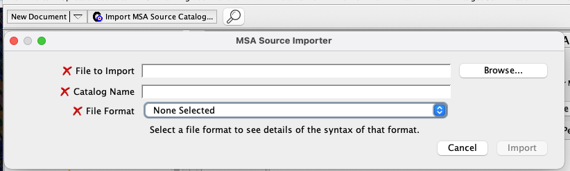
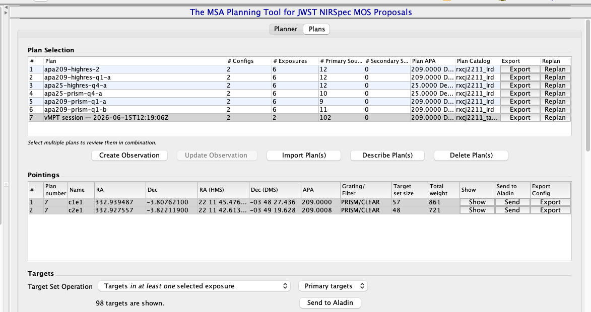

# Exporting & sharing

vMPT writes a self-contained **bundle directory** that captures
your full session. Same writer for `Save session` and
`Export eMPT bundle`; the only difference is where the files land.

## Files written

The two **APT-facing** files are target-prefixed so it's obvious which
file APT/MPT loads (`<catalog_stem>` is your loaded catalog's name):

| File | Format | Consumed by |
|---|---|---|
| `<catalog_stem>_APT_catalog.cat` | Text (tab-sep) | APT *Import MSA Source Catalog* |
| `<catalog_stem>_MPT_plan.json` | JSON | APT MPT *Import Plan(s)* |
| `README.md` | Markdown | you — the import steps below, filled in for this bundle |
| `vMPT_workspace.json` | JSON | vMPT-only (full state) |
| `eMPT_observed_targets.cat` | Text | eMPT pipeline |
| `eMPT_pointing_summary.txt` | Text | eMPT pipeline |
| `eMPT_shutter_mask.csv` | CSV | eMPT pipeline |

A multi-config plan also writes a `config_N/` subfolder per pointing
with that config's own eMPT products.

`vMPT_workspace.json` is the **canonical save**: every other file
can be regenerated from it. The recipient just needs to point
`Load session` at the workspace JSON (or the `*_MPT_plan.json` — the
sibling is auto-discovered).

### `.cat` columns

`# ID  RA  DEC  Weight  Primary  [Magnitude]  [Redshift]  Label`

- **Weight** — APT's ranking field. vMPT writes the source's *weight*,
  falling back to its *priority* where no weight is set (APT's MSA
  catalog format has a `Weight` column but no `Priority` column).
- **Primary** — `1` = a source from your input catalog; `0` = a slitlet
  vMPT opened that had no catalog source (a `vMPT_synth` row).
- **Magnitude / Redshift** — carried from your input catalog when present
  (a missing value is written as `99.9` mag / `-1` redshift, not `NaN`,
  which APT rejects); the columns are omitted entirely if your catalog
  has neither.
- **Label** — your original source ID / label, preserved for traceability.

## Loading into APT / MPT

The bundle's generated `README.md` spells these steps out with the exact
filenames for that run. The general flow:

1. **Import the source catalog.** In APT click **Import MSA Source
   Catalog**. Set **File to Import** to `<catalog_stem>_APT_catalog.cat`,
   type the **Catalog Name** (use the `.cat` stem — it matches
   `catalog.name` in the plan), and set **File Format** to **Whitespace
   Separated**. Click **Import**.

   

   *APT's MSA Source Importer — set File Format to "Whitespace Separated"
   for a vMPT `<catalog>_APT_catalog.cat`.*

2. **Import the plan.** Open the **MSA Planning Tool → Plans** tab and, in
   the **Plan Selection** box, click **Import Plan(s)** → choose
   `<catalog_stem>_MPT_plan.json`. Each configuration loads as its own
   **Pointings** entry. With the plan selected, click **Create
   Observation** (or **Update Observation**).

   

   *The imported vMPT plan in MPT's **Plans** tab — here a 2-config plan
   shows its two pointings (`c1e1`, `c2e1`) under **Pointings** (v1.5.0
   plans up to five, each its own pointing); use **Create / Update
   Observation** to turn it into an APT observation.*

3. **Finish the design.** In the observation set the **Nod Pattern**
   column to **3-Shutter Slitlet** (vMPT plans 3-shutter slitlets), then
   set exposure parameters / dithers as your program needs.

## Loading into the eMPT pipeline

The three `eMPT_*` files mirror the format ESA's eMPT pipeline
expects:

```bash
cd /your/empt/checkout/
./step_0_ipa.sh                          # uses eMPT_pointings.txt
./step_1_observed.sh                     # uses eMPT_observed.cat
./step_2_shutters.sh                     # uses eMPT_shutter_mask.csv
```

## Loading back into vMPT

`Load session` accepts either:

- `vMPT_workspace.json` (full state — picks, slitlet size, snap
  setting, layer toggles, undo history, custom catalog columns)
- `MPT_plan.json` (less complete — picks + pointing only; the
  sibling `vMPT_workspace.json` is auto-discovered if present)

This is the **collaboration loop**: pick → save session → share the
bundle → collaborator opens it, edits, saves their own bundle →
back to you.

## Round-trip guarantee

A `Save session` followed by `Load session` reproduces the canvas
exactly. The integration tests in `tests/test_session_io.py` and
`tests/test_end_to_end.py` pin this round trip.

## What lives outside the bundle

These stay on your machine and are **not** written into the bundle:

- The image file (FITS or JPG + WCS sidecar) — too large; vMPT
  remembers the path.
- The original catalog file — vMPT writes its own copy via the
  `.cat` exporter; the source CSV/FITS isn't bundled.
- Stuck-open shutter mask — comes from CRDS, refreshed every run.
- Operability snapshot — same.

So when a collaborator opens your bundle, they need the **same**
image file at the **same** path you used. If they're on a
different machine, they can either symlink to their local copy or
load the image themselves first, then `Load session` on top of it.
